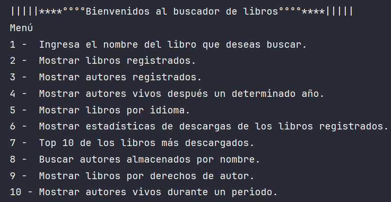

<h1 align="center"> LiterAlura </h1>

#challengeOneLiterAluralatam8

## [:page_with_curl:Descripción del proyecto](#hola)
**
Literalura es una aplicación desarrollada en Java que permite buscar, visualizar y almacenar información sobre libros :books: y autores :smiley: obtenida desde una API pública (Gutendex). El sistema facilita el acceso a una base de datos literaria, permitiendo filtrar libros:
<ol>
  <li>Buscar libro en la API y almacenar en la base de datos.</li>
  <li>Libros registrados.</li>
  <li>Autores registrados.</li>
  <li>Autores vivos después un determinado año.</li>
  <li>Libros por idioma.</li>
  <li>Estadísticas de descargas de los libros registrado.s</li>
  <li>Top 10 de los libros más descargados.</li>
  <li>Buscar autores almacenados por nombre.</li>
  <li>Libros por derechos de autor.</li>
  <li>Mostrar autores vivos durante un periodo.</li>
</ol>

El proyecto implementa una arquitectura basada en Java con Spring Boot, persistencia con JPA y PostgreSQL, y hace uso de patrones modernos de desarrollo, repositorios y consultas derivadas (Derived Queries). La aplicación se ejecuta desde consola con un menú interactivo que guía al usuario en la consulta y registro de datos. 

**

## [Estado del proyecto](#Estado-del-proyecto)

<h4 align="center">
:checkered_flag: Proyecto terminado :checkered_flag:
</h4>

## [:hammer:Funcionalidades del proyecto](#Características-de-la-aplicación-y-demostración)
- `Funcionalidad 1`: Buscar libros por título usando la API de Gutendex.
- `Funcionalidad 2`: Guardar libros y autores en una base de datos PostgreSQL.
- `Funcionalidad 3`: Mostrar autores por año de nacimiento o intervalo de fechas (BD).
- `Funcionalidad 4`: Visualizar los 10 libros más descargados (BD).
- `Funcionalidad 5`: Visualizar el libro más y menos descargado, así como un promedio del total de descargas (BD).
- `Funcionalidad 6`: Filtrar libros por idioma utilizando un enum personalizado (BD).
- `Funcionalidad 7`: Filtrar libros por derechos de autor (BD).
- `Funcionalidad 8`: Validar entradas del usuario para mejorar la experiencia y prevenir errores (BD).

## [:calling:Tecnologías utilizadas](#Tecnologías-utilizadas)
<ul>
  <li>Java 21</li>
  <li>Spring Boot</li>
  <li>Spring Data JPA</li>
  <li>PostgreSQL</li>
  <li>API REST (Gutendex)</li>
  <li>Maven</li>
</ul>

## [:link:Acceso al proyecto](#acceso-proyecto)

<ul>
  <li>https://github.com/Midori-Mirai/literalura</li>
</ul> 

## :girl:[Personas-Desarrolladores del Proyecto](#personas-desarrolladores)

| [ Zaricell Bautista](https://github.com/Midori-Mirai) |  
| :---: | :---: | :---: |
